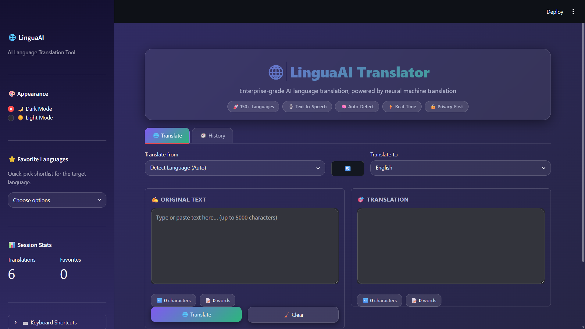
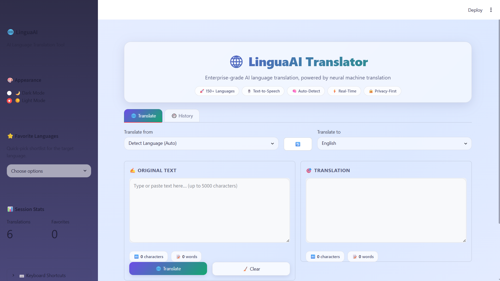
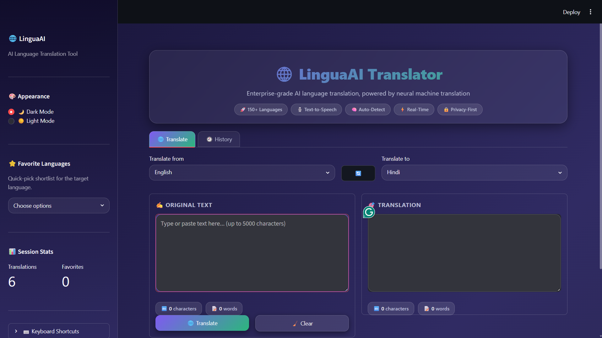
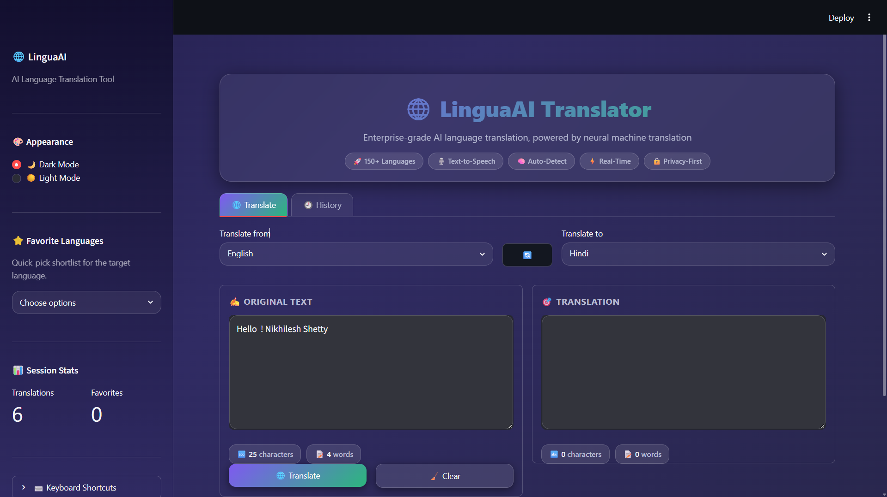
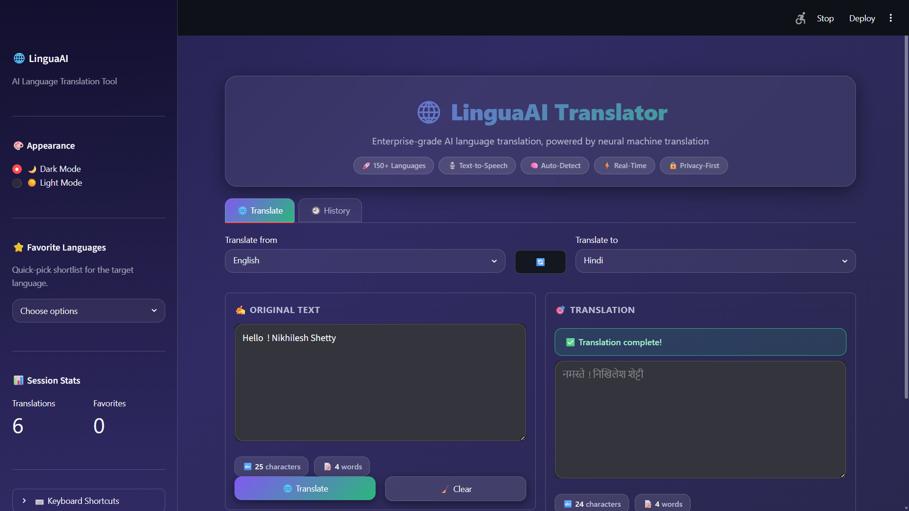
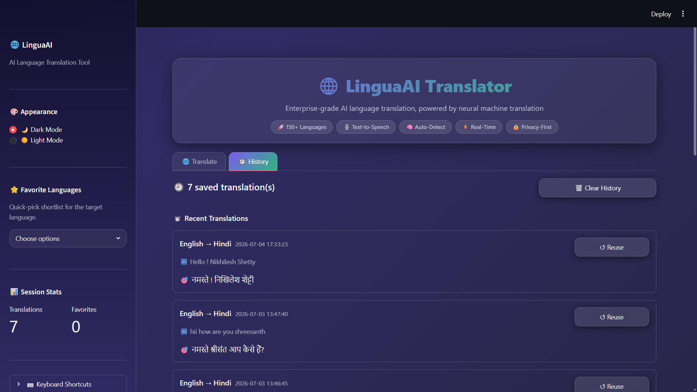
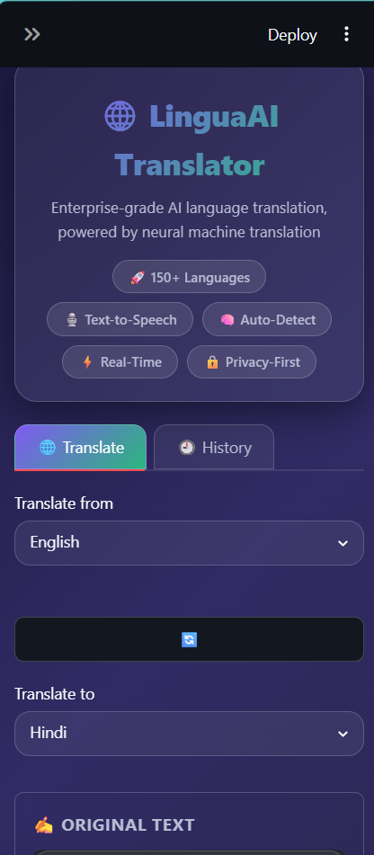
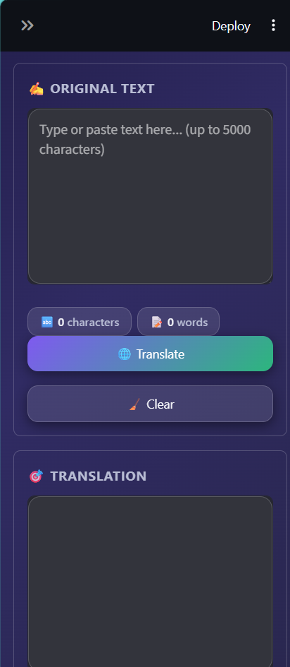

# 🌐 LinguaAI Translator

**An AI-powered, production-grade language translation web application** — built as the *AI Language Translation Tool* for the **CodeAlpha Artificial Intelligence Internship**.

LinguaAI is not a script — it's a fully architected SaaS-style translation product: 150+ languages, automatic language detection, natural text-to-speech, persistent translation history, and a premium glassmorphism dark/light UI, all wired together with clean, modular, type-hinted Python.


---

## ✨ Overview

LinguaAI Translator lets you translate text between **150+ languages** using Google's Neural Machine Translation engine, with a UI designed to feel like a real commercial product rather than a demo script. It was built to be **resume-worthy, GitHub-worthy, and portfolio-worthy** — showcasing full-stack AI engineering, clean architecture, and product-level UI/UX craft in a single Streamlit codebase.

---

## 🚀 Features

### Core Translation
- ✔️ **Auto Language Detection** — powered by a local statistical model (`langdetect`), no extra API calls needed
- ✔️ **150+ Languages** — sourced and validated against Google Translate's live language table
- ✔️ **Searchable Source/Target Dropdowns** — type to filter instantly
- ✔️ **One-Click Swap** — flip source ⇄ target languages (and their text) instantly
- ✔️ **Translate / Clear buttons** with instant visual feedback
- ✔️ **Character & Word Counters** on both input and output panels
- ✔️ **Loading Animations** — animated spinner while the AI translates
- ✔️ **Robust Error Handling** — friendly, actionable error banners for network issues, empty input, oversized text, or unsupported language pairs
- ✔️ **Input Validation** — length limits, empty-input guards, identical-language guards

### Output Actions
- ✔️ **Copy Translation** — native browser clipboard copy (works in deployed web apps, not just localhost)
- ✔️ **Text-to-Speech** — natural spoken audio via gTTS, streamed directly in-browser
- ✔️ **Download as `.txt`** — one click, timestamped filename

### History & Productivity
- ✔️ **Persistent Translation History** — saved to disk as JSON, survives app restarts
- ✔️ **Recent Translations Panel** — with one-click "Reuse" to reload any past translation
- ✔️ **Export History as CSV** — full history table, downloadable via `pandas`
- ✔️ **Favorite Languages** — pin your most-used languages in the sidebar
- ✔️ **Keyboard Shortcuts** — `Ctrl/Cmd + Enter` to translate, `Ctrl/Cmd + Backspace` to clear

### Design & UX
- ✔️ **Glassmorphism UI** — frosted-glass cards, blur, soft shadows
- ✔️ **Animated Gradient Background**
- ✔️ **Dark Mode & Light Mode** — instant theme switch from the sidebar
- ✔️ **Fully Responsive** — mobile-friendly layout down to phone widths
- ✔️ **Smooth Micro-Animations** — fade-ins, hover states, button transitions
- ✔️ **Sidebar Navigation** — branding, theme switch, favorites, session stats, help

---

## 🏗️ Architecture

The project follows a **clean, layered architecture** so business logic, UI rendering, and orchestration never bleed into each other:

```
app.py            → Controller: page config, session state, wiring
components/       → View: pure Streamlit rendering, one concern per file
utils/            → Service layer: translation, TTS, history, validation — no Streamlit imports
assets/           → Static design tokens (CSS)
history/          → Runtime-generated persistent history store (JSON)
```

This separation means `utils/` is fully unit-testable in isolation (no UI dependency), and any component can be swapped or reused without touching business logic.

---

## 📁 Folder Structure

```
LanguageTranslator/
│
├── app.py                     # Main entry point (Streamlit orchestration)
├── requirements.txt           # Python dependencies
├── README.md                  # You are here
├── LICENSE                    # MIT License
│
├── assets/
│   └── style.css               # Glassmorphism / gradient / animation stylesheet
│
├── utils/                      # Business logic (framework-agnostic)
│   ├── __init__.py
│   ├── languages.py             # 150+ language catalogue & lookups
│   ├── translator.py            # Translation + detection service (deep-translator, langdetect)
│   ├── tts.py                   # Text-to-speech synthesis (gTTS)
│   ├── history.py               # JSON-persisted translation history + CSV export
│   ├── theme.py                 # Dark/Light theme CSS engine
│   └── validators.py            # Input validation & text metrics
│
├── components/                 # Streamlit UI components
│   ├── __init__.py
│   ├── header.py                 # Hero banner
│   ├── sidebar.py                # Sidebar navigation & settings
│   ├── translator_ui.py          # Main translate workflow
│   ├── history_ui.py             # History tab
│   ├── copy_button.py            # JS-powered clipboard copy widget
│   └── shortcuts.py              # Global keyboard shortcut bindings
│
└── history/
    └── translation_history.json  # Auto-created at runtime (persisted history)
```

---

## 🛠️ Tech Stack

| Layer | Technology |
|---|---|
| Language | Python 3.12 |
| UI Framework | Streamlit |
| Translation Engine | `deep-translator` (Google Translate) |
| Language Detection | `langdetect` |
| Text-to-Speech | `gTTS` (Google Text-to-Speech) |
| Data Handling | `pandas` |
| Image/Asset Support | `Pillow` |
| Clipboard (scripting utility) | `pyperclip` |

---

## ⚙️ Installation

**Prerequisites:** Python 3.10+ (developed and tested on 3.12), pip, and an internet connection (required for translation and speech synthesis, which call Google's services).

```bash
# 1. Clone the repository
git clone https://github.com/your-username/LanguageTranslator.git
cd LanguageTranslator

# 2. Create a virtual environment (recommended)
python -m venv venv

# Activate it
# Windows:
venv\Scripts\activate
# macOS / Linux:
source venv/bin/activate

# 3. Install dependencies
pip install -r requirements.txt

# 4. Run the app
streamlit run app.py
```

The app will open automatically at `http://localhost:8501`.

---

## ▶️ Usage

1. **Select languages** — choose a source language (or leave it on *"Detect Language (Auto)"*) and a target language using the searchable dropdowns.
2. **Enter text** — type or paste up to 5,000 characters into the input panel; live character/word counters update instantly.
3. **Translate** — click **🌐 Translate** or press `Ctrl/Cmd + Enter`.
4. **Act on the result** — copy it to your clipboard, listen to it spoken aloud, or download it as a `.txt` file.
5. **Swap** — click **🔄** to instantly flip source and target languages.
6. **Review history** — switch to the **🕘 History** tab to browse, reuse, or export past translations as CSV.
7. **Personalize** — use the sidebar to switch between Dark/Light mode and pin favorite languages.

---

## 🖼️ Screenshots

### 🌙 Dark Mode


### ☀️ Light Mode


### 🌐 Translation Result


### 🌐 Translation Result (Example 2)


### 🌐 Translation Result (Example 3)


### 🕘 History


### 📱 Mobile View


### 📱 Mobile View (Alternative)


---

## 🔭 Future Improvements

- [ ] User accounts with cloud-synced history (Supabase / Firebase)
- [ ] Document translation (`.pdf`, `.docx` upload → translated document)
- [ ] Real-time conversation / camera-based (OCR) translation
- [ ] Offline translation via local transformer models
- [ ] Multi-language batch translation from CSV upload
- [ ] Browser extension companion app
- [ ] Automated test suite (`pytest`) with CI/CD via GitHub Actions
- [ ] Dockerfile + one-click deployment to Streamlit Community Cloud / Render

---

## 📄 License

This project is licensed under the **MIT License** — see the [LICENSE](LICENSE) file for details.

---

## 👤 Author

**Nikhilesh**
Final-Year Computer Engineering Student
Built for the **CodeAlpha Artificial Intelligence Internship**

⭐ If you found this project useful or impressive, consider starring the repository!
